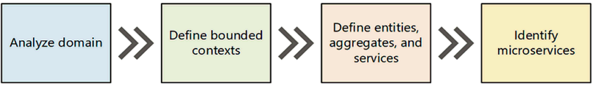
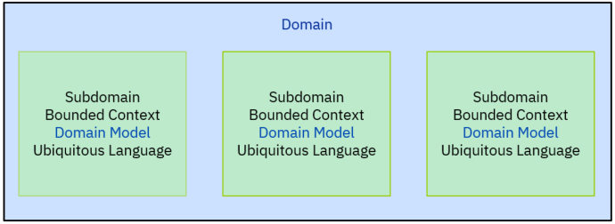
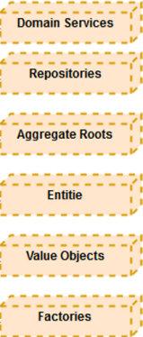
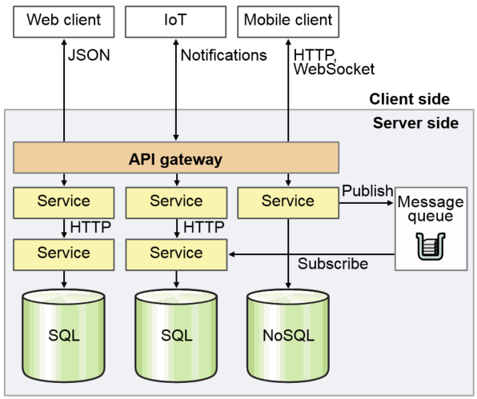
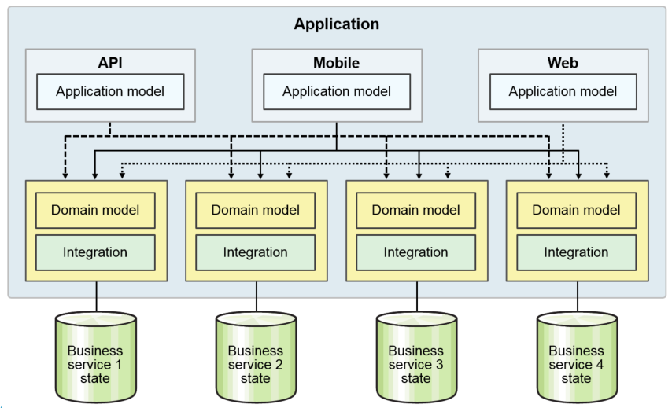
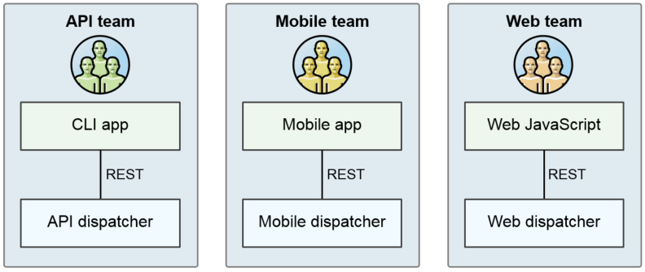
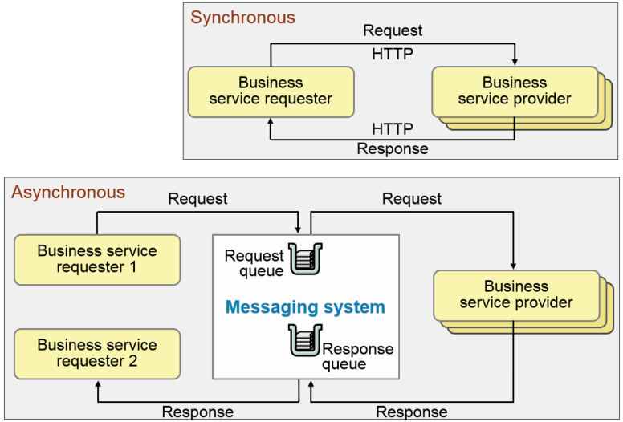

# Implementing Domain-Driven Design for Microservice Architecture

Microservices is an application architectural style with a clear bounded context, interface and dependencies emerged from the Domain-Driven Design architectural patterns and DevOps; each microservice is a loosely coupled service with a single responsibility principle, where each component is a full but miniature application that’s focused on producing a single business task. The business task is meaningful to the business users—no technical or infrastructure microservices. Each has a clear interface and dependencies (such as to other microservices and external resources) so that the microservice can run relatively independently and the team can develop it reasonably independently.

_Microservices make developers (not just computers) more efficient. It does so by enabling them to accomplish meaningful work (e.g., develop meaningful parts of apps) while working in small teams. Small teams make developers (and people in general) more productive because they spend less time in meetings (and otherwise communicating with and coordinating with others) and more time developing code_ [*](https://developer.ibm.com/courses-center/microservices-making-developers-efficient-dwc024/) . And the users ultimately use the code developers write—not the meetings they attend, the architectural diagrams they draw, the status updates they send their managers. The more time developers spend writing code, the more value they’re producing for the users. (Or, if developers writing code aren't delivering value for users, something’s wrong! Their team is dysfunctional, or they need to think about a career change!)

Before delving into the microservices design patterns; first, we need to analyze and understand the business domain (business-capabilities concept); today's business environment is extremely complex and competitive with little to no margin for error any false decision can lead to a catastrophic outcome. Mitigating this risk is essential; thus, adopting an approach to software development for complex domains is highly recommended; Domain-Driven Design (DDD) is a software development approach around solving complex domain model; the solution revolves around the business model by connecting the implementation to the core business concepts.  The common terminology between the business/domain experts and the development team are **domain logic**, **subdomains**, **bounded contexts**, **context maps**, **domain models**, and **ubiquitous language** as a way to collaborate and improve the application model and resolve any emerging domain-related issues.

Microservices are not without their drawbacks; a lack of **DevOps** and **automation** may impede your microservices initiative and could bring more pain than benefits, but this is a topic for a future blog post; meanwhile, let's stress on the gains that the microservice architecture bring organization aside business capabilities and modular services:

- Scalability
- Availability
- Resiliency
- Independent, autonomous
- Decentralized governance
- Failure isolation
- Auto-Provisioning
- Continuous delivery through DevOps

Using the right approach to building microservices it’s more about the software's architectural design, providing a structure of practices to take design decisions that help in software projects that have complicated domains. It focuses on the area of a specific business to gain a better understanding of what the domain is all about. One must start by modeling the business understanding and modeling the real-world problem to be solved. Domain-Driven Design is a framework based on **strategic** value, and it’s about mapping business domain concepts into software artifacts.

**FIGURE 1: Microservices Journey.**

Any microservice implementation could benefit by following this prescriptive approach: 
- Analyze domain
- Defined bounded contexts
- Define entities, aggregates, and services
- Identify microservices

## Analyze domain
A domain refers to real-world aspects of a solution (e.g., automobile, banking, mortgage, credit, debit accounts, credit cards, retails loans, content management, etc.) The domain informs the requirements and acceptance criteria for the system to be implemented by the developer; the domain can be suggestive of a very high-level form of segregation for different areas of the business. For our microservices to successfully implemented it requires a clean separation of concern by applying some boundaries as suggested by Domain-Driven Design approach:

- Teams are usually working in certain business domains
- The business domain is the core focus of the team
- The granularity of a domain depends on the position of a team in the organization

The Domain model captures concepts and processes for a specific business domain and require a deep understanding of the field in question, so the best way to accomplish these requirements is through [Event Storming](https://en.wikipedia.org/wiki/Event_storming);   Event Storming is a workshop-based method to find out what is happening in the domain quickly. The process starts from the context of events happening in a domain and looks at events as fundamental elements in a model. 

### Subdomains

A domain can be decomposed into subdomains, which is one particular part of the domain. Typically reflect some organizational structure in which some users use a specific ubiquitous language. For example, <u>automobile</u> can be decomposed into logistics, researches & development, traders, production and marketing; where research & development itself can further be decomposed to design, CAD (computer-aided design), test, assistance systems, infotainment, product planning, and engine development, which is a good example of domain decomposition also know as subdomain.

- Each domain can be structured in subdomains
- Mapping applications to domain and subdomains is a classical Enterprise Architecture approach
- Each subdomain can contain further subdomains
- Typical Black-and-Whitebox modelling
- There can be communication between various subdomains

**FIGURE 2: Domain Model Design**
### Domain Model

A domain is an area that project covers; it has its terminology, ubiquitous language, requirements, and problems to solve; it is a concrete domain with its small world. The field can be automobile, banking, mortgage, credit, debit accounts, credit cards, retails loans, content management, our new project. A domain has its natural boundaries too; it does not cover everything.

## Defined bounded contexts

After deciding on the solution domain, one of the initial goals is to identify bounded contexts. When you explicitly define your bounded contexts, you can usually see whether you have elements of a model that are trying to expand multiple contexts. A bounded context is a conceptual boundary where a domain model is applicable. The entire business model is too large and complex to understand as a unit and not feasible to maintain a unified model for an entire enterprise. We need to mark boundaries and relationships between different models. From there you will be ready to embrace **strategic design** using:
- Subdomains
- Bounded Contexts
- Domain Models
- Ubiquitous Language
- Context Map

A Bounded Context is a strategic design with a clear boundary within which a domain model exists. Inside the boundary, all terms and phrases of the Ubiquitous Language have a specific meaning, and the model reflects the Language with exactness. Having bounded contexts also helps to formalize the interactions between different services and build the interfaces between them effectively and efficiently.

### Ubiquitous Language
Ubiquitous Language _is the term uses in Domain-Driven Design for the practice of building up a common, rigorous language between developers and users. This language should be based on the Domain Model used in the software - hence the need for it to be rigorous since software doesn't cope well with ambiguity._ [*](https://www.martinfowler.com/bliki/UbiquitousLanguage.html)

### Bounded Contexts (Implementation)
A bounded context is a clear boundary around a domain model and determines the parts of the domain the model will apply on. The bonded context primarily encapsulates the ubiquitous language and its domain model, but it includes what exists to provide interaction with and support the domain model. A bounded context is a software artifact and often seen as an excellent way to scope a microservice functionality.

- One team per Bounded Context
- Separate code repository for each Bounded Context
- Domain Model + DB Schema + UI + Web Services (API)
- Subdivide large domains into smaller contexts.
- Each context can have its own ubiquitous language and its own model.
- Bounded Contexts may share some domain aspects.

### Context Map
An enterprise application has multiple models, and each model has its own Bounded Context. It is advisable to use the context as the basis for team organization. People in the same team can communicate more easily, and they can do a better job integrating the model and the implementation. While every team works on its model, it is good for everyone to have an idea of the overall picture.

## Define entities, aggregates, and services
The entity, value object, aggregate,  services, factory, and repository are the building blocks also known as the **tactical** approach to Domain-Driven Design toward its full realization:

**FIGURE 3: Domain-Driven Design Tactical Design**

[Eric Evans's](https://amzn.to/ffL1k) book [Domain Driven Design: Tackling Complexity in the Heart of Software] describes these in details; I'll only create a small classification for you to get started.

### Entity 

We design a domain object as an Entity when we care about its individuality where we have to determine its identity correctly and how we are going to obtains it. 

- A noun with own intrinsic identity
- Mutable - State can change over time
- Can be associated with other entities and value objects
- Can’t be shared
- Entities have a history and can be traced
### Value Object
We design domain concepts as a Value Object when we care only about the attributes of an element of the model and not in its identity; we should strive to model using Value Object instead of Entity wherever possible. To decide whether a concept is a Value, you should determine whether it possesses most of these characteristics:
- It measures, quantifies, or describes a thing in the domain
- It can be maintained as immutable - State can’t change
- It models a conceptual whole by composing related attributes as an integral unit
- It is entirely replaceable when the measurement or description changes
- It can be compared with others using Value equality
- It supplies its collaborators with Side-Effects-Free Behavior
- A noun without an identity
- Immutable - State can’t change
- Can be associated with other entities
- Can be shared
- Does not have a lifespan, no history associated with them
- Shouldn't have their tables in the database.
### Aggregate
An aggregate is an associated cluster object which is considered as one unit (also knows as a transaction) root entity. Aggregates have a clearly defined boundary (only cares about integrity and responsibility of the object inside the aggregate, it does not care about external objects). Aggregates protect internal objects from the outside world (outside objects can only access by the root aggregate and can’t change the state of the objects in the aggregate). The aggregate has the responsibility to protect the integrity of the entities and value objects they have.
- One root entity per aggregate
- Associated entities can refer to root but not other entities in the aggregate
- All operations are done through root

#### The 4 rules for making Aggregate design straightforward: 
#####**1 - Model True Invariants in the Consistency Boundaries**
- An invariant is a business rule that must always be consistent
- A good Aggregate can be modified in any way and all invariants should be consistent
- A proper application modifies only one Aggregate per transaction
- A properly designed aggregate: can be modified in any way required by the business with in-variants completely consistent within a single transaction.

#####**2 - Design Small Aggregates**
- If you have a big aggregate, you could have scalability performance problems
- Limit the Aggregate to the Root Entity and a minimal number of attributes and/or Value Objects
- Check if your defined invariants are real invariants

#####**3 - Reference Other Aggregates by Identity**
- We are going to avoid the temptation to modify two aggregates on a single transaction

#####**4 - Use Eventual Consistency Outside the Boundary**
- Check with the business if eventual consistency is ok. Normally it is!!
Any rule that spans **AGGREGATES** will not be expected to be up-to-date at all times.

### Service

A domain service is a stateless operation that fulfills a domain-specific task, which performs significant business process and capable of transforming a domain object from one composition to another, normal uses:

- Services are the actions in your application
- Services cause state changes to Entities
- Has operations that conceptually doesn't below to an domain object
- Stateless
- Interface is defined in terms of other elements of the domain model
- A service can be part of any layer (Application, Domain, Infrastructure)
- Still driven by name principles of Ubiquitous Language and Domain Expertise
### Factory

The factory pattern has the responsibility for getting the needed information and constructing the object for the domain as aggregate; best usage of the factory pattern:

- Creates the entities and value objects
- Use only when the entity creation is complex
### Repository

A repository encapsulates a collection of objects stored in the database.

- Collection of entities
- Takes care of updating an entity
- Takes care of retrieving an already persisted entity
- One repository per aggregate root
- Layer abstraction that can be file, storage or in memory database

## Identify microservices
Step 4 (Identify microservices) comprises of Microservice architecture, Microservices architecture layers, Back ends for front ends, Asynchronous communication and Microservices intercommunication to name a few to help write a Microservices based application.

### Microservice architecture
We define a set of bounded contexts for a microservices application. Then we looked more closely at one of these bounded contexts, the Change management bounded context, and identified a set of entities, aggregates, and domain services for that bounded context by doing so we can define an architecture that structures the application as a set of loosely coupled, collaborating services. Each service implements a set of narrowly, related functions. For example, an application might consist of services such as the order management service, the customer management service, etc.

Services communicate using either synchronous protocols such as HTTP/REST or asynchronous protocols such as AMQP (Advanced Message Queuing Protocol). Services can be developed and deployed independently of one another. Each service has its database to be decoupled from other services. Data consistency between services is maintained using the [Saga pattern](https://microservices.io/patterns/data/saga.html).

_As the services are very granular, client applications usually need to interact with multiple services to get the data they need. To allow changes in the services without affecting the clients, an API Gateway is used. The API Gateway is an abstract layer that hides away all the microservices, leaving a single endpoint for clients to communicate. Requests coming to the gateway will be proxied/routed to the appropriate services. The gateway can also help us to monitor the usage of the services efficiently._ [*](http://khoadinh.github.io/2015/05/01/microservices-architecture-overview.html)

Microservice, a component in this architecture:
- Each is a miniature application
- Each is focused on one task, a business capability (The Single Responsibility principle: _**Each microservice implements only one business responsibility from the bounded domain context. From a software point of view, the system needs to be decomposed into multiple components where each component becomes a microservice. Microservices have to be lightweight, in order to facilitate smaller memory footprints and faster startup times.**_)
- Each can be deployed and updated independently
- They are loosely coupled
- Each has a well-defined interface: REST APIs

**FIGURE 4: Microservices Architecture.**

Microservices architecture is far more flexible and resilient providing these benefits of using this approach to build an application:
- Microservices architecture is a very promising way of designing and building highly scalable applications in an agile way. The services themselves are straightforward, focusing on doing only one thing well, so they’re easier to test and ensure higher quality.
- Each service can be built with the best-suited technologies and tools, allowing polyglot persistence and such. You don’t have to be stuck with a new choice of technology for the rest of the project.
- Multiple developers and teams can deliver independently under this architecture. This is great for continuous delivery, allowing frequent releases while keeping the rest of the system stable.
- In case a service goes down, it will only affect the parts that directly depend on it (if there are such parts). The other parts will continue to function well.
- **Externalized configuration:** This externalizes the configurations in the config server so that it can be maintained in a hierarchical structure, per environment.
- **Consistent:** Services should be written in a consistent style, as per the coding standards and naming convention guidelines...
- **Resilient:** Services should handle exceptions arising from technical reasons (connectivity and runtime), and business reasons (invalid inputs) and not crash. Patterns, such as circuit breakers and bulk headers, help isolate and contain failures.
- **Good citizens:** Microservices should report their usage statistics, the number of times they are accessed, their average response time, and so on through the JMX API or the HTTP API.
- **Versioned:** Microservices may need to support multiple versions for different clients until all clients migrate to higher versions. There should be a clear version strategy in terms of supporting new features and bug fixing...

### Microservices architecture layers
The business services tend to do what the domain model and integration layers used to do, and so are still implemented that way. (This is also what the SOA services used to do (or were supposed to).) It’s just that these layers don’t span the whole app, they’re encapsulated within each service. (Yeah, the O/R mapping in the integration layer was more broadly reusable when the layer spanned the whole app. Microservices value independence over reuse. And you should be using No SQL database anyway, so you shouldn’t need all that O/R mapping code. But to tell the truth, some business services will still need to interface with legacy enterprise databases of record, which are SQL, so they’ll need O/R mapping code; there’s no free lunch.)

The dispatchers do what the app model used to do: One stop shopping for the client so that all of the business services together look like a single app that does exactly what the client needs. But now you have an app model for each client type, not a single app model layer that spans the entire app.

What happened to the view layer? It moved into the clients (where it belonged all along!). Either the client is a mobile app, which is a view with perhaps a bit of its app model; or it’s a partner app that’s way more than just a view, but that has its own views, or it’s a web app. Web apps used to contain a lot of view code to render the HTML, and needed state from the view in an HTTP session, but no more. With modern techniques using HTML 5 and CSS 3, the web browser uses static files (downloaded from the web site) to do all that rendering and store the session state.

**FIGURE 5: Microservices architecture layers.**

### Backend for frontend (BFF)
Each dispatcher is a back end for an external front end, typically a GUI
The same team develops each back end and front-end pair; Use the same or compatible languages in the pair.
_Usually, rather than have one team write all/multiple dispatchers while someone else implements the clients, instead put the same team in charge of a dispatcher/client pair. The two are going to have to be designed for each other, so have the communication take place within a team, not between teams. The skills tend to be different for different types of clients, so let the teams specialize._[*](https://developer.ibm.com/courses-center/backend-frontend-bff-dwc024/)

**FIGURE 6: Back ends for front ends.**

### Asynchronous communication
Asynchronous communication can make microservices more robust
- The requester doesn’t have to block while the provider runs
- Different requester instance can handle the response
- Messaging system holds action and result

_Consider integrating asynchronously. Synchronous REST is usually easier to get something working, so start with that. Then consider strategically converting some integration points to async, either because of the nature of the request (long-running, runs in the background) or to make the integration more reliable and robust._[*](https://developer.ibm.com/courses-center/synchronous-versus-asynchronous-communication-dwc024/)

How is async invocation more reliable? With sync, the whole loop—requester, provider, messages—has to keep working though the whole lifetime of the invocation. With async, the invocation is broken into 3-4 parts; if any one fails, the system can probably retry it for you. Heck, because the requester is stateless, the instance that receives the response doesn’t even have to be the instance that sent the request.

**FIGURE 7: Asynchronous communication.**

### Microservices intercommunication
Different microservices may be implemented in different languages (now or in the future), so don’t lock yourself into a language-specific integration technology (say, Java sockets, or even CORBA/IIOP). The standard these days is REST, and JSON/REST, so use that. For asynchronous integration, follow an open cloud-friendly standard like AMQP _[an open standard transaction message protocol that is significantly lowering the cost of middleware software integrations through interoperable business messaging. It is the ideal protocol for passing business-critical, real-time data across and between organizations and virtual cloud computing transactions environments in a secure manner]_ or Kafka [*](https://www.youtube.com/watch?v=SXZJau292Uw).
is an open standard transaction message protocol that is significantly lowering the cost of middleware software integrations through interoperable business messaging. It is the ideal protocol for passing business-critical, real-time data across and between organizations and virtual cloud computing transactions environments in a secure manner
Try to resist the urge to use other approaches like XML or serialization. That leads to a combinatorial explosion of protocols that each API provider and the consumer has to support.

Other examples of asynchronous protocols: 
- Message Hub
- MQ Light
- RabbitMQ

Lightweight protocols
- REST such as JSON or HTTP
- Messaging such as Kafka

The aim is complete decoupling, achieved by these methods:
- Messaging wherever possible
- Service registry or discovery
- Load balancing
- Circuit breaker patterns

We can mix and match sync and async. Usually, a request/response invocation is either all sync or all async, but this shows that a single invocation can be sync in one direction and async in the other.

**FIGURE 8: Microservices intercommunication.**

## Conclusion
Our goal with this blog post was to share our thoughts on how to marriage Domain-Driven Design  (DDD) with microservice architecture; (DDD) is a software development approach around solving complex domain model; the solution revolves around the business model by connecting the implementation to the core business concepts.  The common terminology between the business/domain experts and the development team are domain logic, subdomains, bounded contexts, context maps, domain models, and ubiquitous language as a way to collaborate and improve the application model and resolve any emerging domain-related issues. Our approach was to put some structure around getting to understand the business domain by analyzing the domain, defining the bounded contexts, defining the entities, aggregates, and services and finally identifying the microservices. Microservices offer some unique advantages over traditional architectures, and it provides, scalability, availability, resiliency to name a few; it also a right approach for keeping developers laser-focused as each microservice is a loosely coupled service with a single responsibility principle.

## Collaboration
This blog post was written with the help of [Richard Wilkins](https://medium.com/@richardwilkins999) as a result of our many exchanges on Microservice Architecture, Application Modernization, and Cloud Native discussions. Thanks, Richard!

## References
For more on Domain-Driven Design and, Microservice Architecture refer to the reference section below where you can find many more topic that I have highlighted and a few posts I urge you to visit to gain the most out this blog post.

* [Domain Driven Design: Tackling Complexity in the Heart of Software, by Eric Evans](https://amzn.to/ffL1k)
* [Implementing Domain-Driven Design, by Vaughn Vernon.](http://www.informit.com/store/implementing-domain-driven-design-9780133039894)
* [Domain-Driven Design](https://medium.com/the-software-architecture-chronicles/domain-driven-design-924c21e3ac29)
* [What are microservices?](https://microservices.io/)
* [DDD — What is Domain Driven Design?](https://medium.com/@henrique.eidt/ddd-what-is-domain-driven-design-d66de2db5df4)
* [An introduction to Domain-Driven Design](https://medium.com/inato/an-introduction-to-domain-driven-design-386754392465)
* [How I First Used Domain-Driven Design](https://hackernoon.com/how-i-first-used-domain-driven-design-652814794567)
* [A Brief Intro to Domain Driven Design](https://austinstartups.com/a-brief-intro-to-domain-driven-design-326cf1669bbc)
* [Breaking Complexity Using Domain-Driven Design](https://medium.com/@mitrais/breaking-complexity-using-domain-driven-design-cd62db9ff0cc)
* [Transforming to Microservices ](https://www.slideshare.net/kylegbrown5/transforming-to-microservices)
* https://developer.ibm.com/courses-center/backend-frontend-bff-dwc024/)
